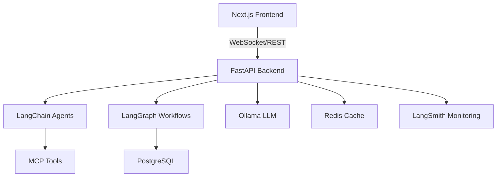

# 🚀 IntelliFlow - Agentic Intelligence Platform

[](https://www.python.org/downloads/)
[](https://fastapi.tiangolo.com/)
[](https://nextjs.org/)
[](https://www.typescriptlang.org/)
[](https://www.docker.com/)
[](LICENSE)

## 🎯 Overview

IntelliFlow is an enterprise-grade multi-agent workflow automation platform that orchestrates specialized AI agents to automate complex business workflows. Built with cutting-edge technologies including LangChain, LangGraph, and local LLMs via Ollama.


## ✨ Features

- 🤖 **Multi-Agent System**: 5 specialized AI agents (Research, Code, Data, Communication, Planning)
- 🔄 **Workflow Orchestration**: Visual workflow builder with LangGraph
- 🎨 **Glassmorphism UI**: Beautiful, modern interface with real-time updates
- 🔒 **Enterprise Security**: JWT authentication, rate limiting, input validation
- 📊 **Real-time Monitoring**: Live agent status and performance metrics via LangSmith
- 🚀 **Local LLM**: Privacy-first with Ollama and Llama 3.1
- 🔌 **MCP Integration**: Extensible tool system for custom capabilities
- 🐳 **Docker Ready**: Complete containerized deployment

## 🏗️ Architecture



## 🛠️ Tech Stack

### Backend
- **FastAPI** - High-performance Python web framework
- **LangChain** - Framework for building AI agents
- **LangGraph** - Workflow orchestration engine
- **Ollama** - Local LLM runtime
- **PostgreSQL** - Primary database
- **Redis** - Caching and message queue
- **SQLAlchemy** - ORM for database operations

### Frontend
- **Next.js 14** - React framework with App Router
- **TypeScript** - Type-safe JavaScript
- **Tailwind CSS** - Utility-first CSS framework
- **Framer Motion** - Animation library
- **Socket.io** - Real-time communication

### AI/ML
- **Llama 3.1** - Open-source language model
- **LangSmith** - LLM observability platform
- **MCP** - Model Context Protocol for tools

## 🚀 Quick Start

### Prerequisites

- Docker & Docker Compose
- Node.js 18+ (for local development)
- Python 3.9+ (for local development)
- Ollama (for local LLM)

### Using Docker (Recommended)

```bash
# Clone the repository
git clone https://github.com/MlvPrasadOfficial/Agentic_Intelligence.git
cd Agentic_Intelligence

# Copy environment variables
cp backend/.env.example backend/.env
cp frontend/.env.example frontend/.env

# Start all services
docker-compose up -d

# Access the application
# Frontend: http://localhost:3000
# Backend API: http://localhost:8000
# API Docs: http://localhost:8000/docs
```

### Local Development

#### Backend Setup

```bash
cd backend

# Create virtual environment
python -m venv venv
source venv/bin/activate  # On Windows: venv\Scripts\activate

# Install dependencies
pip install -r requirements.txt

# Setup database
alembic upgrade head

# Run the server
uvicorn app.main:app --reload --port 8000
```

#### Frontend Setup

```bash
cd frontend

# Install dependencies
npm install

# Run development server
npm run dev
```

#### Ollama Setup

```bash
# Install Ollama (varies by OS)
# macOS: brew install ollama
# Linux: curl -fsSL https://ollama.ai/install.sh | sh

# Start Ollama server
ollama serve

# Pull Llama 3.1 model
ollama pull llama3.1
```

## 📖 Usage

### Creating a Workflow

1. **Access Dashboard**: Navigate to http://localhost:3000
2. **Create New Workflow**: Click "Create New Workflow" button
3. **Select Type**: Choose from Market Research, Code Documentation, or Custom
4. **Configure**: Set parameters and input data
5. **Execute**: Watch real-time agent execution
6. **Results**: Download reports and action items

### API Examples

#### Execute Workflow

```python
import requests

response = requests.post(
    "http://localhost:8000/api/workflows/execute",
    json={
        "workflow_type": "market_research",
        "parameters": {
            "company_name": "TechCorp",
            "industry": "SaaS",
            "competitors_count": 5
        }
    },
    headers={"Authorization": "Bearer YOUR_TOKEN"}
)

workflow_id = response.json()["workflow_id"]
```

#### Monitor Agent Status

```javascript
const socket = io('ws://localhost:8000');

socket.on('agent_status', (data) => {
    console.log(`Agent ${data.agent_name}: ${data.status}`);
});
```

## 🧪 Testing

```bash
# Backend tests
cd backend
pytest tests/ -v

# Frontend tests
cd frontend
npm run test
npm run test:e2e
```

## 📊 Monitoring

Access monitoring dashboards:

- **LangSmith**: View traces at https://smith.langchain.com
- **API Metrics**: http://localhost:8000/metrics
- **Health Check**: http://localhost:8000/health

## 🚢 Deployment

### Docker Production

```bash
docker-compose -f docker-compose.prod.yml up -d
```

### Kubernetes

```bash
kubectl apply -f k8s/
```

### Cloud Platforms

- **AWS**: Use ECS or EKS with provided configurations
- **GCP**: Deploy to Cloud Run or GKE
- **Azure**: Use Container Instances or AKS

## 📚 Documentation

- [API Documentation](http://localhost:8000/docs)
- [Architecture Guide](docs/ARCHITECTURE.md)
- [Development Guide](docs/DEVELOPMENT.md)
- [Deployment Guide](docs/DEPLOYMENT.md)

## 🤝 Contributing

We welcome contributions! Please see [CONTRIBUTING.md](CONTRIBUTING.md) for details.

1. Fork the repository
2. Create your feature branch (`git checkout -b feature/AmazingFeature`)
3. Commit your changes (`git commit -m 'Add some AmazingFeature'`)
4. Push to the branch (`git push origin feature/AmazingFeature`)
5. Open a Pull Request

## 📄 License

This project is licensed under the MIT License - see the [LICENSE](LICENSE) file for details.

## 🙏 Acknowledgments

- [LangChain](https://langchain.com/) for the agent framework
- [Ollama](https://ollama.ai/) for local LLM support
- [FastAPI](https://fastapi.tiangolo.com/) for the backend framework
- [Next.js](https://nextjs.org/) for the frontend framework

## 📞 Contact

**Prasad M** - [@MlvPrasad](https://twitter.com/MlvPrasad)

Project Link: [https://github.com/MlvPrasadOfficial/Agentic_Intelligence](https://github.com/MlvPrasadOfficial/Agentic_Intelligence)

---

⭐ If you find this project useful, please consider giving it a star!

🐛 Found a bug? Please [open an issue](https://github.com/MlvPrasadOfficial/Agentic_Intelligence/issues)

💡 Have a feature request? Let's [discuss](https://github.com/MlvPrasadOfficial/Agentic_Intelligence/discussions)